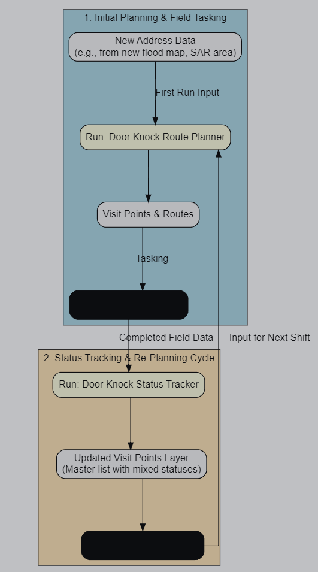

# README

> **Disclaimer: Experimental Plugin** This plugin suite is considered
> experimental. It is designed to demonstrate a potential workflow and
> should be thoroughly tested through desktop exercises and simulations
> before being relied upon in a live operational environment.

# User Guide: Door Knock Planner Suite

### 1. Introduction

The Door Knock Planner is a QGIS plugin suite designed to help plan,
execute, and track door-knocking campaigns for disaster management,
major investigations, or search and rescue operations.

The suite consists of two integrated tools:

1.  **Door Knock Route Planner:** Takes a list of addresses, divides
    them among field crews, and calculates the most efficient, ordered
    route for each crew to follow from a central starting point.
2.  **Door Knock Status Tracker:** Processes completed field data (from
    CSV files, QField, etc.), merges it with the master address list,
    and produces an updated status layer for situational awareness and
    re-planning.

This guide is divided into two parts. Part 1 covers the initial planning
with the Route Planner, and Part 2 covers the ongoing tracking and
re-planning cycle.

------------------------------------------------------------------------

## Part 1: Initial Planning

### 2. Before You Begin: Data Preparation

For the planner to work effectively, you need three essential data
layers ready in your QGIS project. Using up-to-date and accurate data is
highly recommended for the best results.

1.  **Area of Interest (Polygon Layer):** A polygon layer that defines
    the boundary of your operation (e.g., a suburb, a flood extent area,
    a search grid).

2.  **Address Points (Point Layer):** A point layer containing all the
    potential addresses to be visited. **Recommended (Australia):** For
    best results, use the latest version of the Geocoded National
    Address File (GNAF), available from
    [data.gov.au](https://data.gov.au/data/dataset/geocoded-national-address-file-g-naf).

3.  **Road Network (Line Layer):** A line layer representing the streets
    and roads the crews can travel on.

    1.  **Option A - Use Official State Data (Recommended):** For
        operations in Queensland, Australia, the authoritative
        **Queensland Roads and Tracks** dataset is recommended,
        available from
        [data.qld.gov.au](https://www.data.qld.gov.au/dataset/queensland-roads-and-tracks).

    2.  **Option B - Download from OpenStreetMap (Alternative Method):**
        If you do not have a road network file, you can download live
        data from OpenStreetMap directly within QGIS using the
        **QuickOSM** plugin. (Instructions on using QuickOSM remain the
        same…)

### 3. Step-by-Step: Running the Route Planner

1.  **Open the Tool:** In QGIS, open the **Processing Toolbox** panel
    (`View > Panels > Processing Toolbox`). Find the **Door Knock
    Planner** provider and double-click the **Door Knock Route Planner**
    algorithm.
2.  **Fill in the Parameters:**
    - **Area of Interest (Polygon):** Select your boundary polygon
      layer.
    - **Address Points:** Select your address point layer.
    - **Road Network:** Select your road network layer.
    - **Start Location:** Click the `...` button and click on the map to
      set the starting point.
    - **Number of Available Crews:** Enter the number of teams you have
      available.
3.  **Run the Algorithm:** Click the **Run** button.

### 4. Route Planner Outputs

The Route Planner tool will create two new layers:

- **Visit Points (Ordered):** A point layer showing the addresses to be
  visited. It is automatically configured with tracking fields for field
  data collection.
- **Door Knock List (Table):** A non-spatial table formatted for easy
  export to a CSV file for use in the field.

These outputs serve as the input for your field crews and the basis for
the tracking workflow described in Part 2.

------------------------------------------------------------------------

## Part 2: Tracking Progress & Re-Planning

### 5. The Door Knock Status Tracker

This second tool is the key to managing your operation over multiple
shifts. Its purpose is to take the data returned from your field crews,
merge it with your master address list, and produce a single, updated
layer showing the current status of every property.

#### 5.1 Step-by-Step: Running the Status Tracker

1.  **Open the Tool:** In the **Processing Toolbox**, under the **Door
    Knock Planner** provider, double-click the **Door Knock Status
    Tracker** algorithm.
2.  **Fill in the Parameters:**
    - **Completed Crew CSV Files:** Select one or more CSV files that
      have been filled out by your crews.
    - **Original Visit Points Layer:** Select the
      `Visit Points (Ordered)` layer that you created in the previous
      run of the Route Planner.
    - **New Address Layer (Optional):** If you have received new
      intelligence (e.g., an updated flood map with more addresses),
      select that point layer here. The tool will add any new addresses
      to your master list.
    - **Unique Address ID Field:** Select the field that contains a
      unique identifier for each address (e.g., `ADDRESS_DETAIL_PID` or
      `ADDRESS_LABEL`). This is crucial for correctly matching records.
    - **Updated Visit Points:** Specify where to save the new output
      layer. This will be your new master list.
    - **Validation Exception Report (Optional):** Specify a path for a
      CSV report. The tool will list any addresses marked ‘Completed’
      but missing essential data (Date, ID, or Org) in this file for
      your review.
3.  **Run the Algorithm:** Click **Run**. The output will be a new
    layer, `Updated Visit Points`, containing every address with its
    latest status.

### 6. Managing the Operational Cycle

The Planner and Tracker tools are designed to be used in a continuous
cycle of planning, action, and review.

#### 6.1 Workflow for a New Shift

The primary workflow is to use the output of the Tracker to plan the
next set of routes.

1.  **Run the Status Tracker:** Follow the steps in section 5.1 to
    generate the `Updated Visit Points` layer. This layer is your new
    “single source of truth”.
2.  **Filter for Un-Actioned Addresses:**
    - In the QGIS Layers Panel, right-click on your new
      `Updated Visit Points` layer and select **Filter…**.
    - Enter the following expression to show only addresses that still
      require a visit: `"Outcome" != 'Completed' OR "Outcome" IS NULL`
    - Click **OK**. The layer will now only display points that are
      ‘Outstanding’, ‘No Person Home’, etc.
3.  **Re-Run the Route Planner:** Open the **Door Knock Route Planner**
    again. For the **Address Points** input, select your filtered
    `Updated Visit Points` layer. Fill out the other parameters and run
    the tool to generate new, optimized routes for the next shift.

#### 6.2 Workflow Diagram

The following diagram illustrates the cyclical workflow for both
planning the next shift and incorporating new address data.

### 7. Field Data Collection & Customization

#### 7.1 Data Collection Strategy

> **Important:** The CSV-based workflow for the Status Tracker is
> provided as a backup method but is prone to human error (typos,
> incorrect formats). For operational integrity, the **strongly
> recommended** strategy is to use a direct digital collection method
> like **QField** or a **Web Form**. These methods feed data directly
> back into a master source, significantly reducing errors and
> eliminating the need for manual CSV management.

Instructions for using QField and Web Forms are detailed in the sections
below.

#### 7.2 Customizing Survey Questions

The default tracking fields are designed for disaster management. For
Search and Rescue (SAR) or Investigations, you may need different fields
or options. You can customize the `Visit Points (Ordered)` layer after
it has been created by the planner.

**How to Modify the Form:**

1.  In the QGIS Layers Panel, right-click the `Visit Points (Ordered)`
    layer and select **Properties…**.
2.  Go to the **Attributes Form** tab.
3.  **To add or remove ‘Outcome’ options:**
    - Select the `Outcome` field from the “Fields” list.
    - The “Widget Type” will be `Value Map`.
    - In the options below, you can add, remove (`-`), or re-order the
      values in the list.
4.  **To add a new field:**
    - The easiest way is to open the layer’s **Attribute Table**.
    - Click **Toggle Editing** (the pencil icon).
    - Click the **New Field** button and define your new column (e.g., a
      text field called `evidence_collected`).
    - Save your layer edits. You can then configure its appearance in
      the Attributes Form tab.

> **Warning:** If you are using the CSV-based
> `Door Knock Status Tracker`, you **must not remove** the `'Completed'`
> and `'Outstanding'` values from the `Outcome` list. The tracker’s
> logic specifically relies on these text values to function correctly.
> You can add new values, but do not remove these two.

### 8. Important Considerations

- **Performance:** This tool is data-heavy. For best performance, use it
  on a localised area. Running on very large datasets may cause QGIS to
  freeze.
- **Live Events:** The network analysis does **not** account for
  real-time road closures from flooding or other hazards. During a live
  event, you may need to break your area into smaller, accessible zones
  and run the planner for each one.
- **Incomplete Routes:** If the output shows a “NULL” `cost` for some
  addresses, it means a route could not be found. This usually happens
  if your road network layer is incomplete. Try downloading a larger
  road network extent.
